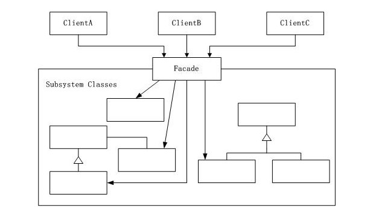

外观模式：提供了一个统一的接口，用来访问子系统中的一群接口。外观定义了一个高层接口，让子系统更容易使用。

在软件开发系统中，客户程序经常会与复杂系统的内部子系统之间产生耦合，而导致客户程序随着子系统的变化而变化。那么如何简化客户程序与子系统之间的交互接口？如何将复杂系统的内部子系统与客户程序之间的依赖解耦？这就是外观模式的作用了，我们通过一个外观类定义一个高层接口，该接口中包含子系统的中的接口，这样客户端只需要通过外观类访问各种子系统就可以啦。结构图表示如下：



看看这个例子：生活中，人们多多少少都玩过股票吧，那么大家知道股票和基金有什么区别吗？股票的风险大，盈利高，但是一般的股民没有专业的知识则盈利的可能性较低。于是有了一批人，开始购买基金，因为基金风险低，盈利又比银行利率可观。那么大家知道这是为什么吗？基金背后是怎么运作的呢？实际上是：我们客户买基金，钱给他们，他们拿着这个钱去买股票，买债券等等来进行钱生钱的活动，相比之下他们有专业的团队，盈利的可能性更大，所以基金就有了存在的意义。对比一下外观模式的定义，是不是发现这和外观模式是极其的吻合呢？基金就是这个外观啊！！看看我们如何完成应用外观模式的代码吧。


```python
import time

SLEEP = 0.5


# Complex Parts
class TC1:

    def run(self):
        print("###### In Test 1 ######")
        time.sleep(SLEEP)
        print("Setting up")
        time.sleep(SLEEP)
        print("Running test")
        time.sleep(SLEEP)
        print("Tearing down")
        time.sleep(SLEEP)
        print("Test Finished\n")


class TC2:

    def run(self):
        print("###### In Test 2 ######")
        time.sleep(SLEEP)
        print("Setting up")
        time.sleep(SLEEP)
        print("Running test")
        time.sleep(SLEEP)
        print("Tearing down")
        time.sleep(SLEEP)
        print("Test Finished\n")


class TC3:

    def run(self):
        print("###### In Test 3 ######")
        time.sleep(SLEEP)
        print("Setting up")
        time.sleep(SLEEP)
        print("Running test")
        time.sleep(SLEEP)
        print("Tearing down")
        time.sleep(SLEEP)
        print("Test Finished\n")


# Facade
class TestRunner:

    def __init__(self):
        self.tc1 = TC1()
        self.tc2 = TC2()
        self.tc3 = TC3()
        self.tests = [i for i in (self.tc1, self.tc2, self.tc3)]

    def runAll(self):
        [i.run() for i in self.tests]


# Client
def client():
    testrunner = TestRunner()
    testrunner.runAll()
client()
```

    ###### In Test 1 ######
    Setting up
    Running test
    Tearing down
    Test Finished
    
    ###### In Test 2 ######
    Setting up
    Running test
    Tearing down
    Test Finished
    
    ###### In Test 3 ######
    Setting up
    Running test
    Tearing down
    Test Finished
    


```python

```
