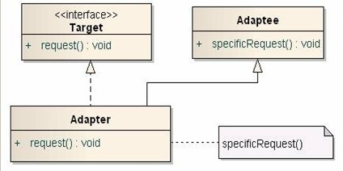

我想作为一个IT人士，对于适配器应该不陌生，只不过要从理论上讲可能描述的不够到位。实际上，好多系统的开发，都要用到第三方软件，这样的话，第三方软件的接口和我们开发的软件的接口往往是不一致的，那么这时候就要“适配”了。看看GoF对适配器模式的说法：

适配器模式：将一个类的接口转换成客户希望的另外一个接口，适配器模式使得由于接口不兼容而不能一起工作的那些类可以一起工作

举个例子,3ds主机的充电口都是接受5v电压的输入充电,而美国中国澳大利亚用的220v的插座,英国用的是英标220v的插口,德法是欧标220v插口,而日本是110v插口,于是为了让我们买的日版主机在不同的地方可以充电,我们就得用适配器了

一般情况下，适配器包含下面的几个角色：

目标抽象角色(Target) : 定义客户所期待要使用的接口，我们把我们的日版3ds当做客户端，客户端所需要使用充电器是大陆标准。

源角色(Adaptee) : 需要被适配的接口，在这里指的是我的3ds买的时候自带的那个5v口。

适配器角色(Adapter) ：用来把源接口转换成符合要求的目标接口的设备，在这里指的是我自己买的变压器。

客户端(Client) ：这里指的就是我那个3ds了。



首先，必须强调的是，适配器模式适用于使用第三方软件的情况，并且第三方软件提供的接口和我们开发的系统接口不一致，同时我们正在开发的系统想要改变接口已经不容易了，这时候使用适配器就比较好。其实，适配器模式更像是一个弥补型的模式，当接口不一致时，并且系统开发已经进入了很难改变的时候，这时候可以使用适配器模式，但是如果在开发的早期就发现了接口不一致，尽量不要采用适配器模式，而是最后把接口设计的一致比较好。也就是说适配器模式大部分在软件开发后期使用的一种设计模式。

具体适用的场合：

1.正在开发的系统想使用一个已经存在的类，并且该类很重要，但是该类提供的接口和系统不一致。

2.使用了第三方软件，并且第三方提供的软件的接口和系统不一致。

3.两个已经存在的类完成的功能一致，但是接口不一样。可以采用适配器模式，提供一致的接口。

4.对旧系统的复用。

使用适配器模式的好处：

1.充分利用已经存在的资源，实现软件的复用，节省开发成本和时间。


```python
class Dog(object):
    def __init__(self):
        self.name = "Dog"

    def bark(self):
        return "woof!"


class Cat(object):
    def __init__(self):
        self.name = "Cat"

    def meow(self):
        return "meow!"


class Human(object):
    def __init__(self):
        self.name = "Human"

    def speak(self):
        return "'hello'"


class Car(object):
    def __init__(self):
        self.name = "Car"

    def make_noise(self, octane_level):
        return "vroom{0}".format("!" * octane_level)

# 可以看到我们的类行为都不同,接口完全不一样,使用适配器改变接口名使之统一
class Adapter(object):
    """
    Adapts an object by replacing methods.
    Usage:
    dog = Dog
    dog = Adapter(dog, dict(make_noise=dog.bark))
    >>> objects = []
    >>> dog = Dog()
    >>> print(dog.__dict__)
    >>> objects.append(Adapter(dog, make_noise=dog.bark))
    >>> print(objects[0].original_dict())
    >>> cat = Cat()
    >>> objects.append(Adapter(cat, make_noise=cat.meow))
    >>> human = Human()
    >>> objects.append(Adapter(human, make_noise=human.speak))
    >>> car = Car()
    >>> car_noise = lambda: car.make_noise(3)
    >>> objects.append(Adapter(car, make_noise=car_noise))
    >>> for obj in objects:
    ...     print('A {} goes {}'.format(obj.name, obj.make_noise()))
    A Dog goes woof!
    A Cat goes meow!
    A Human goes 'hello'
    A Car goes vroom!!!
    """

    def __init__(self, obj, **adapted_methods):
        """We set the adapted methods in the object's dict"""
        self.obj = obj
        self.__dict__.update(adapted_methods)

    def __getattr__(self, attr):
        """All non-adapted calls are passed to the object"""
        return getattr(self.obj, attr)
        
    def original_dict(self):
        """Print original object dict"""
        return self.obj.__dict__

def main():
    objects = []
    dog = Dog()
    print(dog.__dict__)
    objects.append(Adapter(dog, make_noise=dog.bark))
    print(objects[0].__dict__)
    print(objects[0].original_dict())
    cat = Cat()
    objects.append(Adapter(cat, make_noise=cat.meow))
    human = Human()
    objects.append(Adapter(human, make_noise=human.speak))
    car = Car()
    objects.append(Adapter(car, make_noise=lambda: car.make_noise(3)))

    for obj in objects:
        print("A {0} goes {1}".format(obj.name, obj.make_noise()))


main()

```

    {'name': 'Dog'}
    {'make_noise': <bound method Dog.bark of <__main__.Dog object at 0x103f6b438>>, 'obj': <__main__.Dog object at 0x103f6b438>}
    {'name': 'Dog'}
    A Dog goes woof!
    A Cat goes meow!
    A Human goes 'hello'
    A Car goes vroom!!!


```python

```
