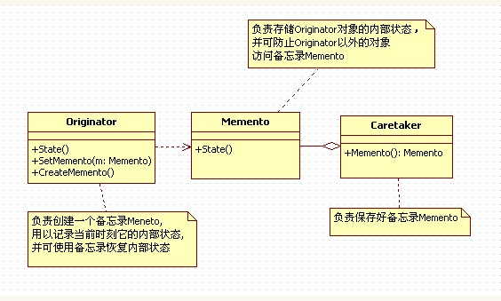

打游戏有存档,这样如果角色死了或者进展不满意,那就可以回到之前的存档重新开始,备忘录模式就是这样一个机制

备忘录模式（Memento）：在不破坏封装性的前提下，捕获一个对象的内部状态，并在该对象之外保存这个状态，这样以后就可将该对象恢复到原先保存的状态。



从结构中看出备忘录模式包含3个角色：

1.Originator(发起人)：负责创建一个备忘录Memento，用以记录当前时刻自身的内部状态，并可使用备忘录恢复内部状态。Originator可以根据需要决定Memento存储自己的哪些内部状态。

2.Memento(备忘录)：负责存储Originator对象的内部状态，并可以防止Originator以外的其他对象访问备忘录。备忘录有两个接口：Caretaker只能看到备忘录的窄接口，他只能将备忘录传递给其他对象。Originator却可看到备忘录的宽接口，允许它访问返回到先前状态所需要的所有数据。

3.Caretaker(管理者):负责备忘录Memento，不能对Memento的内容进行访问或者操作。

使用备忘录模式的场合：

（1）功能比较复杂的，但是需要维护或记录属性历史的类。

（2）需要保存的属性只是众多属性的一小部分时。

使用备忘录模式的好处：

（1）有时一些发起人对象的内部信息必须保存在发起人对象以外的地方，但是必须要由发起人对象自己读取，这时使用备忘录模式可以把复杂的发起人内部信息对其他的对象屏蔽起来，从而可以恰当地保持封装的边界。

（2）本模式简化了发起人类。发起人不再需要管理和保存其内部状态的一个个版本，客户端可以自行管理他们所需要的这些状态的版本。

（3）当发起人角色的状态改变的时候，有可能这个状态无效，这时候就可以使用暂时存储起来的备忘录将状态复原。

使用备忘录模式的缺点：

（1）如果发起人角色的状态需要完整地存储到备忘录对象中，那么在资源消耗上面备忘录对象会很昂贵。

（2）当负责人角色将一个备忘录存储起来的时候，负责人可能并不知道这个状态会占用多大的存储空间，从而无法提醒用户一个操作是否很昂贵。


```python
from copy import copy, deepcopy


def memento(obj, deep=False):
    state = deepcopy(obj.__dict__) if deep else copy(obj.__dict__)

    def restore():
        obj.__dict__.clear()
        obj.__dict__.update(state)

    return restore


class Transaction:
    """A transaction guard.
    This is, in fact, just syntactic sugar around a memento closure.
    """
    deep = False
    states = []

    def __init__(self, deep, *targets):
        self.deep = deep
        self.targets = targets
        self.commit()

    def commit(self):
        self.states = [memento(target, self.deep) for target in self.targets]

    def rollback(self):
        for a_state in self.states:
            a_state()


class Transactional(object):
    """Adds transactional semantics to methods. Methods decorated  with
    @Transactional will rollback to entry-state upon exceptions.
    """

    def __init__(self, method):
        self.method = method

    def __get__(self, obj, T):
        def transaction(*args, **kwargs):
            state = memento(obj)
            try:
                return self.method(obj, *args, **kwargs)
            except Exception as e:
                state()
                raise e

        return transaction


class NumObj(object):
    def __init__(self, value):
        self.value = value

    def __repr__(self):
        return '<%s: %r>' % (self.__class__.__name__, self.value)

    def increment(self):
        self.value += 1

    @Transactional
    def do_stuff(self):
        self.value = '1111'  # <- invalid value
        self.increment()  # <- will fail and rollback


num_obj = NumObj(-1)
print(num_obj)

a_transaction = Transaction(True, num_obj)
try:
    for i in range(3):
        num_obj.increment()
        print(num_obj)
    a_transaction.commit()
    print('-- committed')

    for i in range(3):
        num_obj.increment()
        print(num_obj)
    num_obj.value += 'x'  # will fail
    print(num_obj)
except Exception as e:
    a_transaction.rollback()
    print('-- rolled back')
print(num_obj)

print('-- now doing stuff ...')
try:
    num_obj.do_stuff()
except Exception as e:
    print('-> doing stuff failed!')
    import sys
    import traceback

    traceback.print_exc(file=sys.stdout)
print(num_obj)
```

    <NumObj: -1>
    <NumObj: 0>
    <NumObj: 1>
    <NumObj: 2>
    -- committed
    <NumObj: 3>
    <NumObj: 4>
    <NumObj: 5>
    -- rolled back
    <NumObj: 2>
    -- now doing stuff ...
    -> doing stuff failed!
    Traceback (most recent call last):
      File "<ipython-input-1-fa63a57e05b5>", line 94, in <module>
        num_obj.do_stuff()
      File "<ipython-input-1-fa63a57e05b5>", line 49, in transaction
        raise e
      File "<ipython-input-1-fa63a57e05b5>", line 46, in transaction
        return self.method(obj, *args, **kwargs)
      File "<ipython-input-1-fa63a57e05b5>", line 67, in do_stuff
        self.increment()  # <- will fail and rollback
      File "<ipython-input-1-fa63a57e05b5>", line 62, in increment
        self.value += 1
    TypeError: Can't convert 'int' object to str implicitly
    <NumObj: 2>

