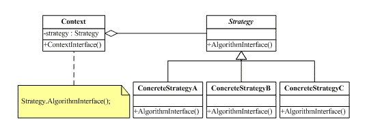

首先还是看看定义吧：策略模式定义了一系列的算法，并将每一个算法封装起来，而且使它们还可以相互替换，策略模式让算法独立于使用它的客户而独立变化。

策略模式包括以下几个部分的内容：

（1）—抽象策略角色： 策略类，通常由一个接口或者抽象类实现。

（2）—具体策略角色：包装了相关的算法和行为。

（3）—环境角色：持有一个策略类的引用，最终给客户端调用。



策略模式的好处:

（1） 策略模式提供了管理相关的算法族的办法，策略类的等级结构定义了一个算法或行为族，恰当使用继承可以把公共的代码移到父类里面，从而避免重复的代码。

（2） 策略模式使得算法的使用者就和算法本身分离开来，使得系统易于扩展，当要加入日本的个人所得税收费方式时，只需要在加一个Strategy的子类，并重写execute方法。

（3）从某种角度上讲，能减少测试的工作量，每个算法可以很容易进行单独测试，并且修改一个算法，也不会对其他算法类造成影响。

什么情况下使用策略模式

（1）如果在一个系统里面有许多类，它们之间的区别仅在于它们的行为，那么使用策略模式可以动态地让一个对象在许多行为中选择一种行为。

（2） 一个系统需要动态地在几种算法中选择一种。那么这些算法可以包装到一个个的具体算法类里面，而这些具体算法类都是一个抽象算法类的子类。换言之，这些具体算法类均有统一的接口，由于多态性原则，客户端可以选择使用任何一个具体算法类，并只持有一个数据类型是抽象算法类的对象。

（3）一个系统的算法使用的数据不可以让客户端知道。策略模式可以避免让客户端接触到的复杂的只与算法有关的数据。

（4） 如果一个对象有很多的行为，如果不用恰当的模式，这些行为就只好使用多重的条件选择语句来实现。此时，使用策略模式，把这些行为转移到相应的具体策略类里面，就可以避免使用难以维护的多重条件选择语句，并体现面向对象设计的概念。、

下面不妨举几个在实际应用中已经使用策略模式的例子：

例1：

比如我们的摘要算法包hmac中,我们就可以选择使用md5还是sha1等

例2：

还比如在玩“极品飞车”这款游戏，那么游戏对车的轮胎是可以更换的，不同的轮胎在高速转弯时有不同的痕迹样式，那么针对“汽车”的配件“轮胎”就要可以变化，而且轮胎和轮胎之间是可以相互替换的，这就是典型的要应用“策略模式”的场景！

python要实现策略模式非常简单,因为可以直接用高阶函数...让函数作为参数传递


```python
import types


class StrategyExample:

    def __init__(self, func=None):
        self.name = 'Strategy Example 0'
        if func is not None:
            self.execute = types.MethodType(func, self)

    def execute(self):
        print(self.name)


def execute_replacement1(self):
    print(self.name + ' from execute 1')


def execute_replacement2(self):
    print(self.name + ' from execute 2')


def main():
    strat0 = StrategyExample()

    strat1 = StrategyExample(execute_replacement1)
    strat1.name = 'Strategy Example 1'

    strat2 = StrategyExample(execute_replacement2)
    strat2.name = 'Strategy Example 2'

    strat0.execute()
    strat1.execute()
    strat2.execute()
main()
```

    Strategy Example 0
    Strategy Example 1 from execute 1
    Strategy Example 2 from execute 2


```python

```
